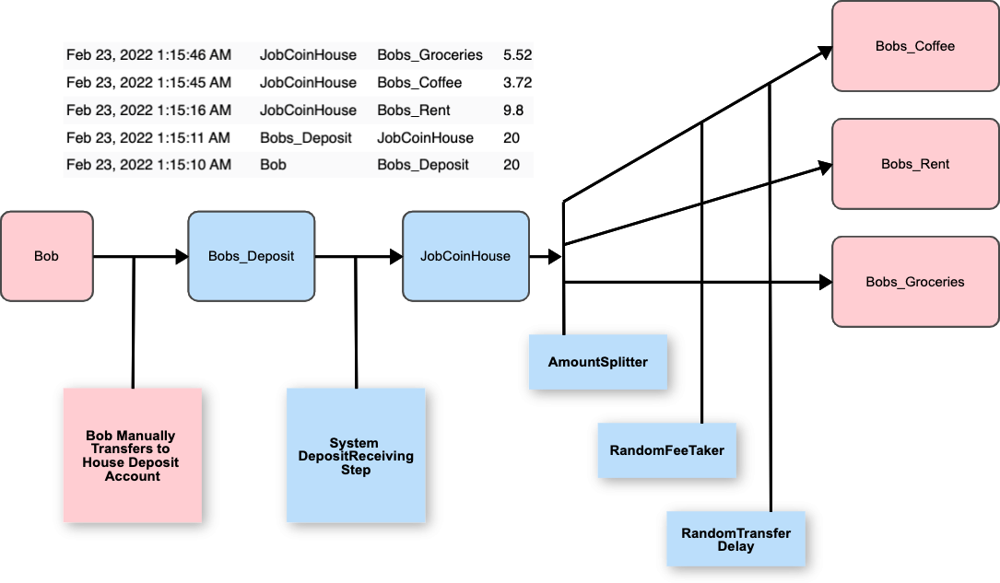

# JobCoin Mixer - [Hitesh Lad](https://github.com/java1337)

## Overview

This codebase is a simple "Mixer" implementation created for the Coin Mixer challenge.



## Features

### Deposits
1. The system will poll for deposits to configured "deposit" accounts controlled by the Mixer
   * Polling is every 5 seconds via the provided API
2. The system will move the deposits to a "House" account mixed with deposits from other customers
   * Multiple clients will be pooled in the same "House" account for maximum anonymity
   * This transfer happens immediately and for the full amount transferred to the deposit account

### Withdrawals
1. The system will poll for deposits to configured "House" account controlled by the Mixer
   * Polling is every 5 seconds via the provided API
2. The system will split the amount to one or more destinations by percentage
   * Future enhancements could add fixed amount or other splitting strategies 
3. The system will take a random fee on each pending outbound transfer
   * Multiple withdrawals from a single client initiated transfer will have different fee percentages
   * As configured, the fee will be between 1% and 9% of the transfer amount, evenly distributed
4. The system will wait a random time before initiating the outbound transfer
   * As configured, the wait time will be between 0 and 30 seconds
   * Multiple withdrawals from a single client initiated transfer will have wait times determined independently 

## Client agnostic configuration

The client agnostic configuration is currently hardcoded in the class [ConfigHardcoded](src/main/scala/com/java1337/work/jobcoin/app/ConfigHardcoded.scala)

| Field                                | Value | Description                                        |
|--------------------------------------|-------|----------------------------------------------------|
| HouseAddress                         | JobCoinHouse | The House account where all deposits are mixed |
| MinimumFeePercentage                 | 1%    | Minimum fee deducted before completing transaction |
| MaximumFeePercentage                 | 9%    | Maximum fee deducted before completing transaction |
| MinimumWithdrawalTransferDelayInSeconds | 0 | Minimum time to wait before initiating a withdrawal |
| MaximumWithdrawalTransferDelayInSeconds | 30 | Maximum time to wait before initiating a withdrawal |
| TransactionPollingIntervalInSeconds  | 5 | How often to poll the api endpoint for new transactions |

## Client specific configuration

The client specific configuration is also hardcoded in the companion object [ConfigHardcoded](src/main/scala/com/java1337/work/jobcoin/app/ConfigHardcoded.scala).  Here is an example:
```scala
    val FIFTY_PERCENT = BigDecimal("0.50")
    val THIRTY_PERCENT = BigDecimal("0.30")
    val TWENTY_PERCENT = BigDecimal("0.20")
    
    val BOBS_ACCOUNT: Account =
        Account(
            "Bobs_Deposit",
            Seq(
                WithdrawalPercentAndAddress(FIFTY_PERCENT, "Bobs_Rent"),
                WithdrawalPercentAndAddress(THIRTY_PERCENT, "Bobs_Groceries"),
                WithdrawalPercentAndAddress(TWENTY_PERCENT, "Bobs_Coffee")
            )
        )
```

## To Do

1. Configuration should be persisted externally to the code
2. Some test cases are missing
3. Not happy with the `DistributingMixer` implementation
   * Not sure how to use for comprehensions with scala Futures
4. Not sure if the `MixerStepLike` abstraction is worth the constraints it adds
5. Not sure if Deposit address is shared across clients.  Current implementation depends on it 
6. Increased anonymity can be achieved by trickling out withdrawals to the configured accounts
7. There may be a bug in the `DistributingMixer` or `RandomTimedTransferMixerStep`, as the last 2 transfers seems to happen within 2 seconds of each other